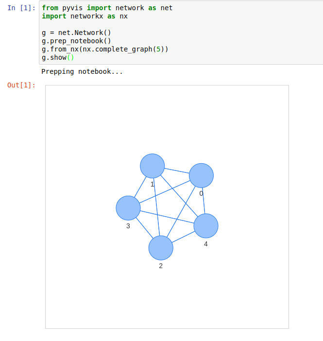

    
============
Tutorial
============
The pyvis library is meant for quick generation of visual network graphs
with minimal python code. It is designed as a wrapper around the popular 
Javascript visJS library found at this link_.

.. _link: https://visjs.github.io/vis-network/examples/

Getting started
---------------
All networks must be instantiated as a ``Network`` class instance

>>> from pyvis.network import Network
>>> net = Network()

Add nodes to the network
------------------------ 
>>> net.add_node(1, label="Node 1") # node id = 1 and label = Node 1
>>> net.add_node(2) # node id and label = 2

Here, the first parameter to the add_node method is the desired ID to give the
Node. This can be a string or a numeric. The label argument is the string that
will be visibly attached to the node in the final visualization. If no label
argument is specified then the node id will be used as a label.

.. note:: The ``ID`` parameter must be unique

You can also add a list of nodes

>>> nodes = ["a", "b", "c", "d"]
>>> net.add_nodes(nodes) # node ids and labels = ["a", "b", "c", "d"]
>>> net.add_nodes("hello") # node ids and labels = ["h", "e", "l", "o"]

.. note:: :meth:`network.Network.add_nodes` accepts any iterable as long as the contents are strings or numerics 

Node properties
---------------
A call to :meth:`add_node` supports various node properties that can be set
individually. All of these properties can be found here_, courtesy of VisJS_.
For the direct Python translation of these attributes, reference the
:meth:`network.Network.add_node` docs. 

.. _here: https://visjs.github.io/vis-network/docs/network/nodes.html
.. _VisJS: https://visjs.github.io/vis-network/docs/network/

.. note:: Through no fault of pyvis, some of the attributes in the VisJS_ documentation do not 
   work as expected, or at all. Pyvis can translate into the JavaScript
   elements for VisJS_ but after that it's up to VisJS_!

Indexing a Node
---------------
Use the :meth:`get_node` method to index a node by its ID:

>>> net.add_nodes(["a", "b", "c"])
>>> net.get_node("c")
>>> {'id': 'c', 'label': 'c', 'shape': 'dot'}

Adding list of nodes with properties
------------------------------------
When using the :meth:`network.Network.add_nodes` method optional keyword arguments can be
passed in to add properties to these nodes as well. The valid properties in this case are

   >>> ['size', 'value', 'title', 'x', 'y', 'label', 'color']

Each of these keyword args must be the same length as the nodes parameter to the method.

Example:

    >>> g = Network()
    >>> g.add_nodes([1,2,3], value=[10, 100, 400], 
                             title=['I am node 1', 'node 2 here', 'and im node 3'], 
                             x=[21.4, 54.2, 11.2], 
                             y=[100.2, 23.54, 32.1], 
                             label=['NODE 1', 'NODE 2', 'NODE 3'], 
                             color=['#00ff1e', '#162347', '#dd4b39'])

.. raw:: html
	:file: mulnodes.html

.. note:: If you mouse over each node you will see that the ``title`` of a node
   attribute is responsible for rendering data on mouse hover. You can add ``HTML`` 
   in your ``title`` string and it will be rendered as such.

.. note:: The ``color`` attribute can also be a plain HTML ``color`` like red or blue. You can also 
   specify the full ``rgba`` specification if needed. The VisJS_ documentation has more 
   details.

Detailed optional argument documentation for nodes are in the
:meth:`network.Network.add_node` method documentation.

Edges
-----

Assuming the network's nodes exist, the edges can then be added according to node id's

   >>> net.add_node(0, label='a')
   >>> net.add_node(1, label='b')
   >>> net.add_edge(0, 1)

Edges can contain a ``weight`` attribute as well

   >>> net.add_edge(0, 1, weight=.87)

Edges can be customized and documentation on options can be found at
:meth:`network.Network.add_edge` method documentation, or by referencing the
original VisJS edge_ module docs.

.. _edge: https://visjs.github.io/vis-network/docs/network/edges.html

`Networkx <https://networkx.github.io/>`_ integration
------------------------------------------------------

An easy way  to visualize and construct pyvis networks is to use `Networkx <https://networkx.github.io>`_ 
and use pyvis's built-in networkx helper method to translate the graph. Note that the
Networkx node properties with the same names as those consumed by pyvis (e.g., ``title``)  are 
translated directly to the correspondingly-named pyvis node attributes.

   >>> from pyvis.network import Network
   >>> import networkx as nx
   >>> nx_graph = nx.cycle_graph(10)
   >>> nx_graph.nodes[1]['title'] = 'Number 1'
   >>> nx_graph.nodes[1]['group'] = 1
   >>> nx_graph.nodes[3]['title'] = 'I belong to a different group!'
   >>> nx_graph.nodes[3]['group'] = 10
   >>> nx_graph.add_node(20, size=20, title='couple', group=2)
   >>> nx_graph.add_node(21, size=15, title='couple', group=2)
   >>> nx_graph.add_edge(20, 21, weight=5)
   >>> nx_graph.add_node(25, size=25, label='lonely', title='lonely node', group=3)
   >>> nt = Network('500px', '500px')
   # populates the nodes and edges data structures
   >>> nt.from_nx(nx_graph)
   >>> nt.show('nx.html')

.. raw:: html
	:file: nx.html

Visualization
-------------

The displaying of a graph is achieved by a single method call on
:meth:`network.Network.show()` after the underlying network is constructed.
The interactive visualization is presented as a static HTML file.

>>> net.toggle_physics(True)
>>> net.show('mygraph.html')

.. note:: Triggering the :meth:`toggle_physics` method allows for more fluid graph interactions 

Example: Visualizing a Game of Thrones character network
--------------------------------------------------------

The following code block is a minimal example of the capabilities of pyvis. 

.. code-block:: python

    from pyvis.network import Network
    import pandas as pd

    got_net = Network(height='750px', width='100%', bgcolor='#222222', font_color='white')

    # set the physics layout of the network
    got_net.barnes_hut()
    got_data = pd.read_csv('https://www.macalester.edu/~abeverid/data/stormofswords.csv')

    sources = got_data['Source']
    targets = got_data['Target']
    weights = got_data['Weight']

    edge_data = zip(sources, targets, weights)

    for e in edge_data:
        src = e[0]
        dst = e[1]
        w = e[2]

        got_net.add_node(src, src, title=src)
        got_net.add_node(dst, dst, title=dst)
        got_net.add_edge(src, dst, value=w)

    neighbor_map = got_net.get_adj_list()

    # add neighbor data to node hover data
    for node in got_net.nodes:
        node['title'] += ' Neighbors: ' + ' '.join(neighbor_map[node['id']])
        node['value'] = len(neighbor_map[node['id']])

    got_net.show('gameofthrones.html')

    
If you want to try out the above code, the csv data source can be `downloaded <https://www.macalester.edu/~abeverid/data/stormofswords.csv>`_

.. note:: The ``title`` attribute of each node is responsible for rendering data on node hover.

.. raw:: html
	:file: gameofthrones.html

Using the configuration UI to dynamically tweak ``Network`` settings
----------------------------------------------------------------
You also have the option of supplying your visualization with a UI used to
dynamically alter some of the settings pertaining to your network. This could
be useful for finding the most optimal parameters to your graph's physics and
layout function.

>>> net.show_buttons(filter_=['physics'])

.. image:: buttons.gif

.. note:: You can copy/paste the output from the `generate options` button in the above UI 
          into :meth:`network.Network.set_options` to finalize your results from experimentation
          with the settings. 

.. image:: set_options_ex.gif

Using pyvis within `Jupyter <https://jupyter.org>`_ notebook
------------------------------------------------------------

Pyvis supports `Jupyter <https://jupyter.org>`_ notebook embedding through the
use of the :meth:`network.Network` constructor.  The network instance must be
"prepped" during instantiation by supplying the `notebook=True` kwarg.
Example:

